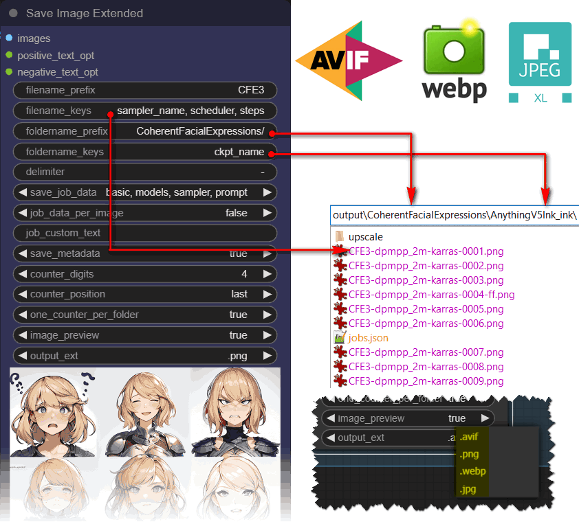
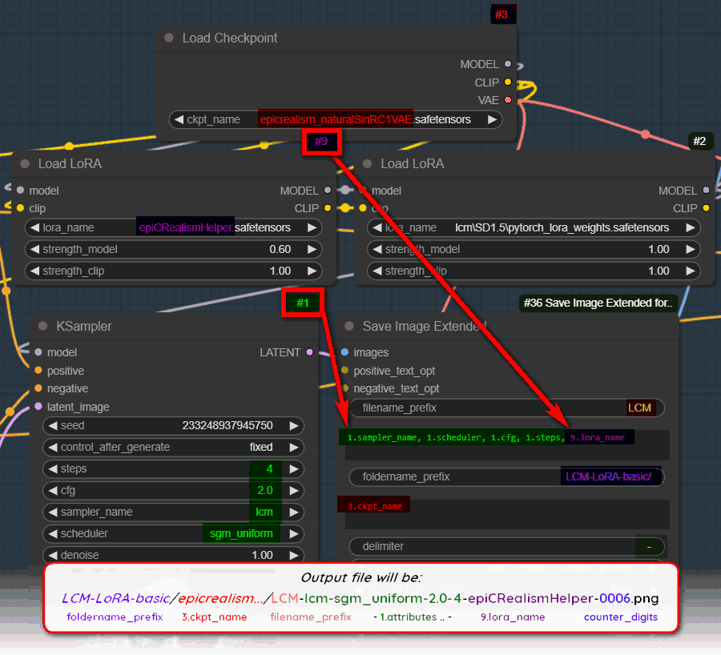
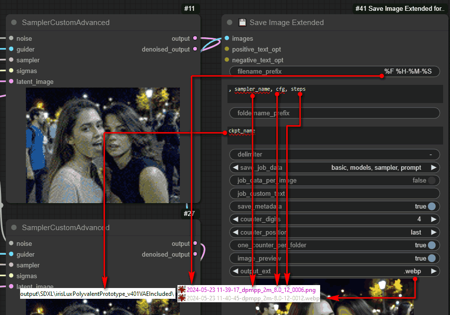
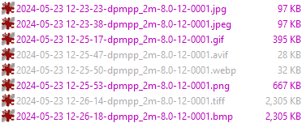
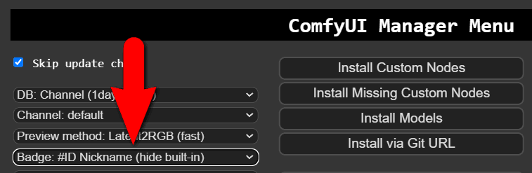

# 💾 Save Image Extended for ComfyUI
Save as AVIF, WebP, JPEG, customize the folder, sub-folders, and filenames of your images!

Supports those extensions: **AVIF WebP JXL jpg jpeg png gif tiff bmp**

<p align="center">
 
</p>

* Customize the folder, sub-folders, and filenames of your images! 
* Save data about the generated job (sampler, prompts, models) as entries in a `json` (text) file, in each folder.
* Use the values of ANY node's widget, by simply adding its badge number in the form _id.widget_name_
* Promt saved in jpeg and AVIF, but ComfyUI can only load PNG and WebP atm


<br>
<p align="center">
 
<br><br>
</p>

## Parameters / Usage

| Attribute | Description |
| --- | --- |
| `filename_prefix` |  String prefix added to files. |
| `filename_keys` | Comma separated string with sampler parameters to add to filename. E.g: `sampler_name, scheduler, cfg, denoise` Added to filename in written order. `resolution`  also works. `vae_name` `model_name` (upscale model), `ckpt_name` (checkpoint) are others that should work. Here you can try any parameter name of any node. As long as the parameter has the same variable name defined in the `prompt` object they should work. The same applies to `foldername_keys`. |
| `foldername_prefix` | String prefix added to folders. |
| `foldername_keys` | Comma separated string with _sampler_ parameters to add to foldername. Add more subfolders by prepending "./" to the key name. |
| `delimiter` | **now a free field** Delimiter = 1 character, can be anything your file system supports. Windows users should still use "/" for subfolders. |
| `save_job_data` | If enabled, saves information about each job as entries in a `jobs.json` text file, inside the generated folder. Mulitple options for saving `prompt`, `basic data`, `sampler settings`, `loaded models`. |
| `job_data_per_image` | When enabled, saves individual job data files for each image. |
| `job_custom_text` | Custom string to save along with the job data. Right click the node and convert to input to connect with another node. |
| `save_metadata` | Saves metadata into the image. |
| `counter_digits` | Number of digits used for the image counter. `3` = image_001.png. Will adjust the counter if files are deleted. Looks for the highest number in the folder, does not fill gaps. |
| `counter_position` | Image counter first or last in the filename. |
| `one_counter_per_folder` | Toggles the counter. Either one counter per folder, or resets when a parameter/prompt changes. |
| `image_preview` | Turns the image preview on and off. |
| `output_ext` |  File extension: PNG by default, or WEBP (coming soon). |

Unknown key names in `filename_keys` and `foldername_keys` are treated as custom strings: if you enter `wrongNumber.attribute`, you will get `attribute` in your filename.

Datetime UNIX format is now included! `%Y-%m-%d` or `%F` etc

## Node inputs

- `images` - The generated images.

Optional:
- `positive_text_opt` - Optional string input for when using custom nodes for positive prompt text.
- `negative_text_opt` - Optional string input for when using custom nodes for negative prompt text.

## Automatic date/time conversion in file/folder names

Converts [unix datetime formats](https://www.man7.org/linux/man-pages/man1/date.1.html):

| Unix datetime | Example | Comment |
| --- | --- | --- |
| %F or %Y-%m-%d | 2024-05-22 | |
| %D | 05/22/24 | This effectively creates subfolders |
| %F %H-%M-%S | 2024-05-22 09-13-58 | |
| %Y/%V | 2024/21 | year subfolder / ISO week number subfolder |

<p align="center">
 
</p>

## Installation
### Requirements:
There is a requirements.txt that will take care of that, but just in case:

- python 10.6
- piexif
- pillow
- pillow-avif-plugin

```
pip install piexif pillow pillow-avif-plugin
```

For Jpeg XL / jxl it's more complicated. You need to install and compile the wheel jxlpy, and therefore, need a valid and functional MSVC installation.

```
pip install jxlpy
```

### Manual Download
1. Open a terminal inside the 'custom_nodes' folder located in your ComfyUI installation dir
2. Use the `git clone` command to clone the [save-image-extended-comfyui](https://github.com/audioscavenger/save-image-extended-comfyui) repo under ComfyUI\custom_nodes\
```
git clone https://github.com/audioscavenger/save-image-extended-comfyui
```

## Miscelaneous
#
Disclaimer: Does not check for illegal characters entered in file or folder names. May not be compatible with every other custom node, depending on changes in the `prompt` object. 
Tested and working with default samplers, Efficiency nodes, UltimateSDUpscale, ComfyRoll, composer, NegiTools, and 45 other nodes.

#
Quality and compression settings: default is 75, 100 will activate **lossless** for AVIF and WEBP only.

Quick comparison of size per extension, for the same picture, AVIF quality=60, WebP quality=75, jpeg quality=91 (and yes, AVIF still looks better then WebP):

<p align="center">
 
</p>

#
About extensions WebP AVIF JPEG JXL: ComfyUI can only load PNG and WebP atm... Feel free to ask ComfyUI team to add support for AVIF/jpeg/JXL!

The metadata Are included under the **EXIF** tags IFD below, as defined [here](https://exiftool.org/TagNames/EXIF.html)
WAS Node Suite also use those tags. They must be next to each other in order to Comfy to be able to load them with drag and drop.

| Data | EXIF | Name | String looks like |
| --- | --- | --- | --- |
| prompt | 0x010f | Make | Prompt: {"5" ... } |
| workflow | 0x010e | ImageDescription | Workflow: {"5" ... } |

You can retrieve the prompt manually with [exiftool](https://exiftool.org/), here are some example commands:
- `exiftool -Parameters -Prompt -Workflow image.png`
- `exiftool -Parameters -UserComment -ImageDescription image.{jpg|jpeg|webp|avif|jxl}`

#
ComfyUI cannot load lossless WebP atm. Feel free to try and fix `pnginfo.js`

#
Incompatible with *extended-saveimage-comfyui* - This node can be safely discarded, as it only offers WebP output. My node already adds JPEG and WebP.

#
You asked for it... Now you can select which node to get the widget values from! Formerly, this custom node would simply return the last value found: useless if you have multiple same nodes...
To see node numbers in the UI, **enable the badge IDs**:
<br>
<p align="center">
 
</p>

#
jobs.json sample: always generated and appended, not sure what it can be used for.
<br>
<p align="center">
 
<br><br>
 Happy saving!
</p>


## RoadMap
*Reboot by AudioscavengeR since 2024-05-05, original idea from [@thedyze](https://github.com/thedyze/save-image-extended-comfyui)*

I won't promise you the moon, but since I use this node myself, I will maintain it as much as I can. I do provide a way to contact me, and will accept PR and collabs. 
Once I feel like I don't have time to work on it, I will gladly transfer ownership or let collabs maintain it.

TODO:

- [ ] improve get_latest_counter: restarts when user renames files after the counter part.
- [ ] offer to place the counter anywhere, as a key in filename_keys
- [ ] keep same counter if extension changes?
- [ ] files will be out of order if prefixes change... that is expected, but is this what we want?

### release 2.64 💾
- added Help at top-right corner, based off KJNodes

### release 2.63 💾
- fixed negative_prompt job save overwritten by positive_prompt
- [x] remove job_custom_text? no, some ppl use it apparently
- [x] remove jobs.json? no, some ppl use it apparently
- [x] ComfyRoll CR XY Save Grid Image: it offers jpeg webp tif - check how it embeds prompt - nope it does not

### release 2.62 💾
- prompt and workflow are saved in IFD 270 and 271 for better load compatibility
- disabled jobs.json by default, this thingy seems useless to me

### release 2.61 💾
- added quality input

### release 2.60 💾
- added extensions jpeg, gif, tiff, bmp
- added image_optimization (only for jpeg)
- now saves prompt and workflow separately into 0x9286/UserComment and 0x010e/ImageDescription

### release 2.51 💾
- added unix datetime formats

### release 2.50 💾
- added JXL support
- added 'BOOLEAN' support

### release 2.46 💾
- bug discovered with *rgthree's Ksampler Config*: using `steps_total` as an input to a Ksampler, will issue the index of the output, instead of the steps value ("\[nodeNum, 0]" instead of steps value). FIX: use `steps_total` instead of `steps`!
- uncommented `__all__` in init.py
- potential bugfix in splitKey, `len(splitKey) = 2` to identify actual "node.widget" format

### release 2.45 💾
- added 💾 in the name

### release 2.44
- so many bugfixes
- complete rework of generate_custom_name to handle ALL the possible scenarios
- [x] bugfix: when using `/name` in foldername_keys, Comfy thinks you want to save outside the output folder

### release 2.43
- [x] support for **AVIF**
- [x] added requirements.txt

### release 2.42
- [x] fixed counter for variable file extensions length

### release 2.41
- [x] bugfix WebP encoding: Comfy could partially read the prompt, but the way they implemented it was buggy. [PR fix submitted](https://github.com/comfyanonymous/ComfyUI/pull/3415).
- [x] WebP is indeed loaded properly like a PNG, if you apply the patch above to `pnginfo.js and `app.js`

### release 2.4
- [x] integrate **webp**
- [x] integrate **jpeg**

### release 2.3
- [x] for each keys, we return only the last value found in the prompt. Not the last Ksampler. Impossible to know which one is the last. Therefore, simply use this syntax: number.widget_name
- [x] filename_keys and foldername_keys become too large, switch to multiline
- [x] also removes subfolders from values found, when people use subfolders like SD15/pytorch_blah.pt etc
- [x] added what I was looking for the last 6 months in the first place: 123.attribute from nodes!
- [x] limit delimiter to 1 char, or file counter will get too complex

### release 2.2
- [x] delimiter is now whatever you want, free field. Limited to 16 characters tho
- [x] all is instance methods, previously we had @staticmethods. Why? Don't know.
- [x] check get_latest_counter: does it still work with subfolders? yessir
- [x] bugfix: custom_name was not updated for int and floats

### release 2.1
- [x] now accepts inexistant keys and use them as fixed strings
- [x] now accepts inexistant keys with / and use them as subfolders

### release 2.0
- [x] Reboot on 2024-05-05

## :ribbon: Licence
[GPL 3.0](https://choosealicense.com/licenses/gpl-3.0/)
