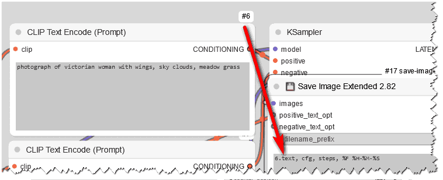
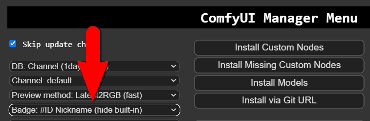
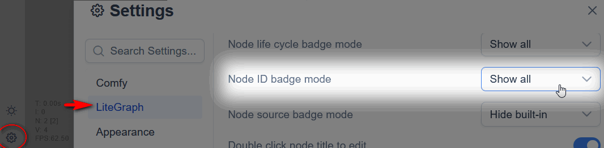

# 💾 Save Image Extended for ComfyUI
Save as JXL, AVIF, WebP, JPEG, JPEG2k, customize the folder, sub-folders, and filenames of your images!

Supports those extensions: **JXL AVIF WebP jpg jpeg j2k jp2 png gif tiff bmp**

<p align="center">
 
</p>

* Customize the folder, sub-folders, and filenames of your images! 
* Save data about the generated job (sampler, prompts, models) as entries in a `json` (text) file, in each folder.
* Use the values of ANY node's widget, by simply adding its badge number in the form _id.widget_name_
* Warning: ComfyUI can only load prompts from PNG and WebP atm


<br>
<p align="center">
 
<br><br>
</p>

## Parameters / Usage

| Attribute | Description |
| --- | --- |
| `filename_prefix` |  Fixed string prefixed to file name. |
| `filename_keys` | Comma separated string with sampler parameters to add to filename. E.g: `sampler_name, scheduler, cfg, denoise` Added to filename in written order. `resolution`  also works. `vae_name` `model_name` (upscale model), `ckpt_name` (checkpoint) are others that should work. Here you can try any parameter name of any node. As long as the parameter has the same variable name defined in the `prompt` object, they should work. The same applies to `foldername_keys`. |
| `foldername_prefix` | Fixed string prefixed to subfolders. |
| `foldername_keys` | Same rules as for `filename_keys`. Create subfolders by using `/` or `../` etc. |
| `delimiter` | **now a free field** Delimiter = any string you like. You can also use `/` to create subfolders. |
| `save_job_data` | Saves information about each job as entries in a `jobs.json` text file, inside the generated subfolder. Multiple options for its content: `prompt`, `basic data`, `sampler settings`, `loaded models`. |
| `job_data_per_image` | Saves individual job data file per image. |
| `job_custom_text` | Custom string to save along with the job data. |
| `save_metadata` | Saves metadata into the image. |
| `counter_digits` | Number of digits used for the image counter. `3` = image_001.png, based on highest number in the subfolder, ignores gaps. **Can be disabled** when == 0. |
| `counter_position` | Image counter postition: image_001.png or 001_image.png. |
| `one_counter_per_folder` | Toggles one counter per subfolder, or resets when a parameter/prompt changes. |
| `image_preview` | Turns the image preview on and off. |
| `output_ext` | File extension: WEBP by default, AVIF, PNG, JXL, JPG, etc. |
| `quality` |  Quality for JPEG/JXL/WebP/AVIF/J2K formats; Quality is relative to each format. Example: AVIF 60 is same quality as WebP 90. PNG compression is fixed at 4 and not affected by this. PNG compression times skyrocket above level 4 for zero benefits on filesize. |
| `named_keys` |  Prefix each value by its key name. Example: prefix-seed=123456-width=1024-cfg=5.0-0001.avif |


- Unknown key names in `filename_keys` and `foldername_keys` are treated as fixed strings
  - if you enter `wrongNumber.attribute`, you will get `attribute` in your filename.
- Datetime UNIX format is now included! `%Y-%m-%d` or `%F` etc: see [unix datetime formats](https://www.man7.org/linux/man-pages/man1/date.1.html)
- default it output only the **name** for `ckpt_name` / `control_net_name` / `lora_name` not the **path**
  - use `ckpt_path` / `control_net_path` / `lora_path` to get the same subfolders as your models
- using `.custom_string` will prevent appending delimiter, the dot will be the delimiter

### FAQ
* How do I format the date/timestamps?
  * see [unix datetime formats](https://www.man7.org/linux/man-pages/man1/date.1.html)
* How do I reference the prompt (aka CLIP Text Encode) in the filename (given it's not too long)?
  * Like this: use `#num.text` 
* How do I show the nodes ID badges?
  * legacy: 
  * modern: 

### Examples
- prefix = `PREFIX`
- filename = `cfg, sampler_name, /steps, %F %H-%M-%S`
- foldername = `ckpt_name/, .cfg`
  - > `v1-5-pruned.cfg / PREFIX-8.0-euler / 20-2024-12-18 23-17-17-0001.png`

- prefix = `PREFIX`
- filename = `cfg, sampler_name, steps, %F %H-%M-%S`
- foldername = `ckpt_name, /, cfg`
  - > `v1-5-pruned / 8.0 / PREFIX-cfg-8.0-euler-20-2024-12-18 23-21-41-0001.png`

- prefix = `PREFIX`
- filename = `"cfg", cfg`
- foldername = `ckpt_name, /, cfg`
  - > `v1-5-pruned / 8.0 / PREFIX-cfg-8.0-0002.png`

## Node inputs

- `images` - The generated images.

Optional:
- `positive_text_opt` - Optional string saved as `positive_text_opt` in job.json when `save_job_data`=True.
- `negative_text_opt` - Optional string saved as `negative_text_opt` in job.json when `save_job_data`=True.

## How To Date/Time conversion in file/folder names:

Converts [unix datetime formats](https://www.man7.org/linux/man-pages/man1/date.1.html) following POSIX format. Examples:

| Unix datetime | Example | Comment |
| --- | --- | --- |
| %F or %Y-%m-%d | 2024-05-22 | |
| %D | 05/22/24 | This effectively creates subfolders |
| %F %H-%M-%S | 2024-05-22 09-13-58 | |
| %Y/%V | 2024/21 | year subfolder / ISO week number subfolder |

<p align="center">
 
</p>

## Installation
### Requirements:
There is a requirements.txt that will take care of that, but just in case:

- python 10.6+
- numpy
- pillow
- pillow-avif-plugin
- pillow-jxl-plugin

```
pip install numpy pillow pillow-avif-plugin pillow-jxl-plugin
```

### Manual Download
1. Open a terminal inside the 'custom_nodes' folder located in your ComfyUI installation dir
2. Use the `git clone` command to clone the [save-image-extended-comfyui](https://github.com/audioscavenger/save-image-extended-comfyui) repo under ComfyUI\custom_nodes\
```
git clone https://github.com/audioscavenger/save-image-extended-comfyui
```


## Known Bugs
* ComfyUI cannot load lossless WebP atm. Feel free to try and fix `pnginfo.js`.
* Pillow cannot save Exif data in JPEG2000, nor can it compress it in any way. Who the heck is using JPEG2000 in 2024 anyway?
* Incompatible with *extended-saveimage-comfyui* - This node can be safely discarded, as it only offers WebP output. My node adds all major and latest image formats.
* WebP cannot handle images larger than 12,000 x 12,0000 pixels and that's by design. Ask a Google developer to fix the cwebp library.
* JXL (pillow-jxl-plugin) cannot even save images 12,000 x 12,0000 pixels and will crash Comfy completely.
* [Load Image //Inspire](https://github.com/ltdrdata/ComfyUI-Inspire-Pack) will keep loaded images as base64 inside the prompt... exploding your output filesize. JPEG has a metadata size limit and will likely fail with error `EXIF data is too long`.


## Miscelaneous

#
Disclaimer: Does not check for illegal characters entered in file or folder names. May not be compatible with every other custom node, depending on changes in the `prompt` object. 
Tested and working with default samplers, Efficiency nodes, UltimateSDUpscale, ComfyRoll, composer, NegiTools, and 45 other nodes.

#
Quality and compression settings: min = 1, default is **90**, max = 100 will activate **lossless** for AVIF and WEBP only.

Quick comparison of size per extension, for the same 512x512 picture, with similar visual quality:
| Ext | Compression | Maker | Size | Compression |
| --- | --- | --- | --- | --- |
| png  | max 9    | PIL     | 413111 | 0% |
| j2k  | n/a      | PIL     | 395028 | 4% |
| jxl  | lossless | PIL     | 301310 | 27% |
| jxl  | 90       | PIL     | 179210 | 57% |
| jpeg | 90       | PIL     |  88554 | 79% |
| avif | 90       | Imagick |  67272 | 84% |
| webp | 90       | Imagick |  64416 | 84% |
| webp | 90       | PIL     |  64356 | 84% |
| avif | 60       | PIL     |  47353 | 89% |
| avif | 60       | Imagick |  33691 | 92% |

#
PNG compression 0-9 is fixed at level 4 for the following reason: ***zero** compression benefits above level 4*, while saving time skyrockets. Test results below for a 2560x1440 image on an Intel i7-9700:
| Compression | time | Size |
| --- | --- | --- |
| 0   | 0.5s | 10.6 MB |
| 1   | 0.6s | 4.6 MB |
| 2   | 0.6s | 4.5 MB |
| 3   | 0.6s | 4.4 MB |
| **4**   | **0.7s** | **4.0 MB** |
| 5   | 1.1s | 4.0 MB |
| 6   | 1.9s | 4.0 MB |
| 7   | 2.6s | 4.0 MB |
| 9   | 10.5s | 3.9 MB |


#
About extensions WebP AVIF JPEG JXL: ComfyUI can only load PNG and WebP atm... Feel free to ask ComfyUI team to add support for AVIF/jpeg/JXL!

The metadata Are included under the **EXIF** tags IFD below, as defined [here](https://exiftool.org/TagNames/EXIF.html)
WAS Node Suite also use those tags. They must be next to each other in order to Comfy to be able to load them with drag and drop.

| Data | EXIF | Name | String looks like |
| --- | --- | --- | --- |
| prompt | 0x010f | Make | Prompt: {"5" ... } |
| workflow | 0x010e | ImageDescription | Workflow: {"5" ... } |

You can retrieve the prompt manually with [exiftool](https://exiftool.org/), here are some example commands:
- `exiftool -Parameters -Prompt -Workflow image.png`
- `exiftool -Parameters -UserComment -ImageDescription image.{jpg|jpeg|webp|avif|jxl}`

#
[JPEG XL is a heated debate on chromium forum](https://issues.chromium.org/issues/40168998#comment85) and if true, that Google is working on WebP2, JXL is unlikely to take off any day soon. Proponents arguably declare with no proof, that jxl is better and faster than the current best codec: AVIF. But again, without support from the industry, it's going nowhere.

I tested with compression 90 and it's good compared to WebP, with a caveat. The compression offered by pillow is 3x lower then Image Magick for the same level. No idea why.


#
jobs.json sample:
<br>
<p align="center">
 
<br><br>
 Happy saving!
</p>


## RoadMap
*Reboot by AudioscavengeR since 2024-05-05, original idea from [@thedyze](https://github.com/thedyze/save-image-extended-comfyui)*

I won't promise you the moon, but since I use this node myself, I will maintain it as much as I can. I do provide a way to contact me, and will accept PR and collabs. 
Once I feel like I don't have time to work on it, I will gladly transfer ownership or let collabs maintain it.

TODO:

- [ ] WebP: explore method values 0-6 and test filesize vs save time
- [ ] WebP: quality has an impact on both lossy and lossless, more testing needed
- [ ] review accepted parameters at https://pillow.readthedocs.io/en/stable/handbook/image-file-formats.html to improve TIFF and other formats
- [ ] accept multiple images as input
- [ ] improve get_latest_counter: restarts when user renames files after the counter part.
- [ ] offer to place the counter anywhere, as a key in filename_keys
- [ ] keep same counter if extension changes?
- [ ] files will be out of order if prefixes change... that is expected, but is this what we want?
- [x] PIL.Image doesn't respect compress_level value and always output max 9 compressed images -> when optimize_image = True! So we turn that off for PNG
- [x] TODO: test import cv2 / OpenCV: https://github.com/python-pillow/Pillow/issues/5986 -> not faster then PIL

### release 2.86 💾
- bugfix in counter_digits which does not accept 0 to disable counter

### release 2.85 💾
- issue/51: #31 #49 API mode KeyError - fix by adding empty {} to the metadata for the API call

### release 2.84 💾
- issue/48: allow no prefix and no filename_keys at all to generate 0001.jpg files
- one_counter_per_folder is depracated as it was in fact, not implemented at all. Cannot remove it or all previous saves will crash the widget

### release 2.83 💾
- quality is now also used for PNG compression: 0-90 translates to 0-9 levels of compression
- requirements.txt and import cleanups, updated wiki

### release 2.82 💾
- bugfix: removed extra debug lines
- improvement: now can extract CLIP text
- improvement: added tooltips

### release 2.81 💾
- fix for pythongosssss/ComfyUI-Custom-Scripts Checkpoint Loader bug and other nodes that store values in a dict

### release 2.80 💾
- tested OpenCV vs PIL for saving images: same speed
- various typos fixed
- counter can now be disabled: 0 digits

### release 2.79 💾
- enhancement 28-request-handle-lora-names-like-checkpoint-names

### release 2.78 💾
- fix 40-subdirectory-creation

### release 2.77 💾
- fix in ckpt_path: will only build subfolders if ckpt_name is also used: https://github.com/audioscavenger/save-image-extended-comfyui/pull/38
- fix for too much rounding of floats (did not affect actual value in prompt saved inside the image)

### release 2.76 💾
- brought back resolution

### release 2.75 💾
- Prefix each value by its key name: prefix-seed=123456-width=1024-etc-0001.avif

### release 2.74 💾
- updated help popup and minor cosmetic fixes

### release 2.73 💾
- added ckpt_path and control_net_path in case you have subfolders for those: default it output only the name
- complete fix of save_images() which allows for use of subfolders in filename_keys
- tried VALIDATE_INPUTS() but all it does is checking 1 single value, no correction

### release 2.70 💾
- added JPEG-XL
- added JPEG2000
- fixed help popup text color in dark mode

### release 2.65 💾
- published in comfy-registry

### release 2.64 💾
- added Help at top-right corner, based off KJNodes

### release 2.63 💾
- fixed negative_prompt job save overwritten by positive_prompt
- [x] remove job_custom_text? no, some ppl use it apparently
- [x] remove jobs.json? no, some ppl use it apparently
- [x] ComfyRoll CR XY Save Grid Image: it offers jpeg webp tif - check how it embeds prompt - nope it does not

### release 2.62 💾
- prompt and workflow are saved in IFD 270 and 271 for better load compatibility
- disabled jobs.json by default, this thingy seems useless to me

### release 2.61 💾
- added quality input

### release 2.60 💾
- added extensions jpeg, gif, tiff, bmp
- added image_optimization (only for jpeg)
- now saves prompt and workflow separately into 0x9286/UserComment and 0x010e/ImageDescription

### release 2.51 💾
- added unix datetime formats

### release 2.50 💾
- added JXL support
- added 'BOOLEAN' support

### release 2.46 💾
- bug discovered with *rgthree's Ksampler Config*: using `steps_total` as an input to a Ksampler, will issue the index of the output, instead of the steps value ("\[nodeNum, 0]" instead of steps value). FIX: use `steps_total` instead of `steps`!
- uncommented `__all__` in init.py
- potential bugfix in splitKey, `len(splitKey) = 2` to identify actual "node.widget" format

### release 2.45 💾
- added 💾 in the name

### release 2.44
- so many bugfixes
- complete rework of generate_custom_name to handle ALL the possible scenarios
- [x] bugfix: when using `/name` in foldername_keys, Comfy thinks you want to save outside the output folder

### release 2.43
- [x] support for **AVIF**
- [x] added requirements.txt

### release 2.42
- [x] fixed counter for variable file extensions length

### release 2.41
- [x] bugfix WebP encoding: Comfy could partially read the prompt, but the way they implemented it was buggy. [PR fix submitted](https://github.com/comfyanonymous/ComfyUI/pull/3415).
- [x] WebP is indeed loaded properly like a PNG, if you apply the patch above to `pnginfo.js and `app.js`

### release 2.4
- [x] integrate **webp**
- [x] integrate **jpeg**

### release 2.3
- [x] for each keys, we return only the last value found in the prompt. Not the last Ksampler. Impossible to know which one is the last. Therefore, simply use this syntax: number.widget_name
- [x] filename_keys and foldername_keys become too large, switch to multiline
- [x] also removes subfolders from values found, when people use subfolders like SD15/pytorch_blah.pt etc
- [x] added what I was looking for the last 6 months in the first place: 123.attribute from nodes!
- [x] limit delimiter to 1 char, or file counter will get too complex

### release 2.2
- [x] delimiter is now whatever you want, free field. Limited to 16 characters tho
- [x] all is instance methods, previously we had @staticmethods. Why? Don't know.
- [x] check get_latest_counter: does it still work with subfolders? yessir
- [x] bugfix: custom_name was not updated for int and floats

### release 2.1
- [x] now accepts inexistant keys and use them as fixed strings
- [x] now accepts inexistant keys with / and use them as subfolders

### release 2.0
- [x] Reboot on 2024-05-05

## :ribbon: Licence
[GPL 3.0](https://choosealicense.com/licenses/gpl-3.0/)

## :beer: Buy me a beer
Like my work? This tool helped you? Want to sponsor more awesomeness like this?

<p align="center">
 <a href="https://www.paypal.com/donate/?hosted_button_id=CD7P7PK3WP8WU"></a>
</p>
